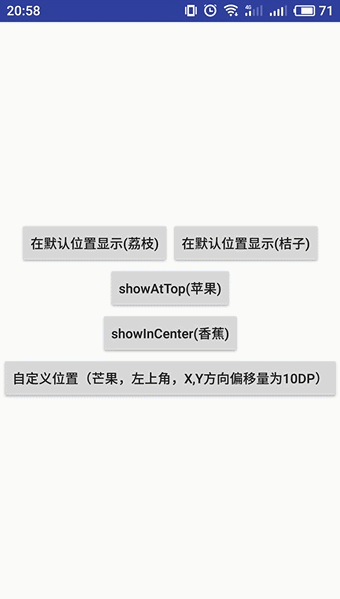
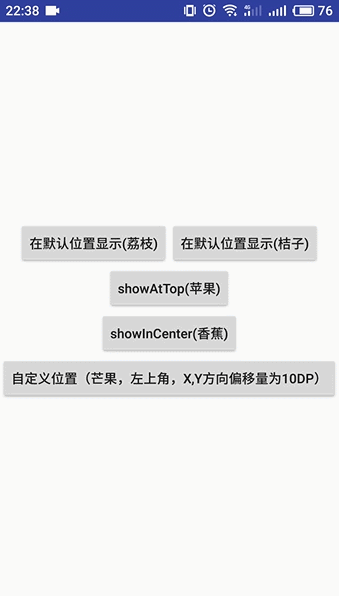
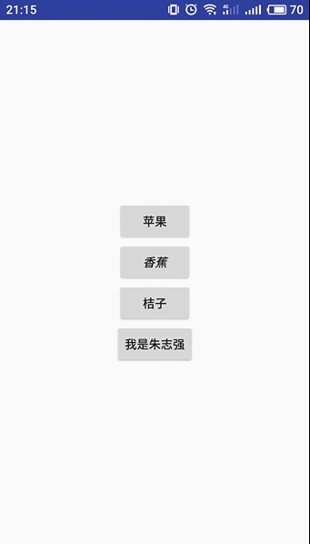
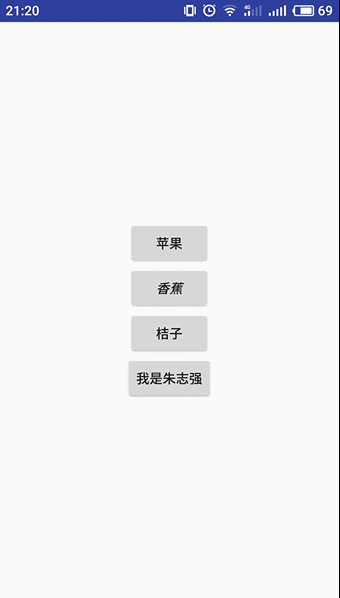

# SmartShow
Smart Toast & Snackbar : 简化调用，并处理常见问题，提高性能和用户体验！作者：朱志强 
如果你对实现感兴趣，请参考我的CSDN博客：http://blog.csdn.net/jungle_pig/article/details/78568493  
该博文已授权《第一行代码》作者郭霖的微信公众号同步发表：http://mp.weixin.qq.com/s/l62PtbmrIOkVKfJ2r0JwEw  
为了让SmartShow库更加健壮，如果您在使用过程中发现任何问题，请联系我，我会立即跟进修复和维护。 
感谢您的支持！ 
微信：w361281607 
邮箱：coder_zzq@163.com 
技术交流QQ群：598117142，可及时反馈bug和功能诉求,接收新版本发布消息等。
## 添加依赖
1.在Project的gradle文件中 
<pre><code>
allprojects {

    repositories {

        ...

        maven { url 'https://jitpack.io' }

    }

}
</code></pre>
2.在Module的grable文件中 
<pre></code>

    compile ( 'com.github.the-pig-of-jungle:SmartShow:v1.0.4' ){

        //去除design包的依赖，其一，你不一定用到SmartSnackbar；其二，你项目使用的版本不一定和库中所用相同

        exclude group: 'com.android.support'

    }

    //若要使用SmartSnackbar，还需添加design包的依赖，添加适合你项目的版本即可

    compile 'com.android.support:design:x.y.z'
</code></pre>
## SmartToast部分
### 特点：
1.全局始终使用一个Toast实例，节省内存 
2.如果Toast正在显示，多次触发同一内容的Toast，不会重复弹出 
3.新的Toast(内容或位置发生了变化)来临时，会立即弹出，不会等到当前显示的Toast的duration耗尽再弹出，虽不会创建新的Toast实例，但具有切换效果（与你手机系统原生Toast的切换动画一致） 
4.可修改Toast默认布局的风格，如背景颜色，文字大小和颜色等 
5.可为Toast设置自定义布局，并进行代码处理 
### 注意
关闭app的系统通知权限,将导致SmartToast无法显示，原因如下： 
Toast的内部原理使用NotificationManagerService，关闭通知权限后，无法显示。 
这是原生Toast本身的特性，而不是SmartShow开源库的bug。 
以淘宝app和优酷app的"再按一次退出程序"的Toast提示为例，关闭他们的通知权限， 
也会导致Toast不显示，感兴趣的话可以去试一试。
### 使用：
第一步，必须初始化，在Application的onCreate()方法中初始化 
方式 1： 
<pre><code>
        //使用默认布局的普通Toast

        SmartToast.plainToast(this);
</code></pre>
若想修改默认布局的风格,可继续链式调用，不过这并不是必须的 
<pre><code>
        //返回PlainToastSetting对象，对布局进行风格设置

        SmartToast.plainToast(this)

                /*

                设置背景颜色，有可选方法，直接以颜色值为参数。Toast的默认背景是一个圆角图片，当你设置了背景颜色时，

                原有背景失效。SmartToast内部用GradientDrawable实现背景，可以保证大小与你手机系统的Toast一致，

                但是不同品牌手机的Toast的圆角半径不尽相同，将统一使用2.5dp

                */

                .backgroundColorRes(R.color.colorPrimary)

                //设置文本颜色，有可选方法，直接以颜色值为参数

                .textColorRes(R.color.colorAccent)

                //设置文本字体大小，单位为sp

                .textSizeSp(18)

                //设置是否加粗文本

                .textBold(true)

                //如果以上还不够，可调用此方法

                .processPlainView(new ProcessViewCallback() {

                    //outParent为显示文本的TextView的父布局，msgView为显示文本的TextView

                    @Override
                    public void processPlainView(LinearLayout outParent, TextView msgView) {

                        //处理代码

                        ...

                    }
                });
</code></pre>
方式 2： 
<pre><code>
        使用自定义布局的Toast

        SmartToast.customToast(this)

                        /*

                        设置自定义布局，有重载方法，直接以View为参数。在你的自定义布局中，一定要设置显示文本提示的

                        TextView的Id为android:id="@id/custom_toast_msg"。如果不调用下面的方法，那么上面的调用与

                        SmartToast.plainToast(this)等效

                        */

                        .view(R.layout.custom_toast);
</code></pre>
若想对自定义的布局进行代码处理,可继续链式调用，不过这并不是必须的 
<pre><code>
        返回CustomToastSetting对象

        SmartToast.customToast(this)

                //填充布局

                .view(R.layout.custom_toast)

                //对自定义布局进行代码处理

                .processCustomView(new ProcessViewCallback() {

                    @Override
                    public void processCustomView(View view) {

                        //处理代码

                        ...

                    }
                });
</code></pre>
第二步，调用show方法显示Toast，duration和常用的显示位置体现在方法名上，而不是传参，使得调用非常简易  
Short Toast 
<pre><code>
        //在默认位置显示

        SmartToast.show("我是朱志强！");

        //在屏幕顶部显示，距离顶部位置为Toast在Y方向默认的偏移距离

        SmartToast.showAtTop("我是朱志强!");

        //在屏幕中央显示

        SmartToast.showInCenter("我是朱志强！");

        //在指定位置显示，x,y方向偏移量单位为dp

        SmartToast.showAtLocation("我是朱志强",Gravity.LEFT | Gravity.TOP,10,10);
</pre></code>
Long Toast 
<pre><code>
        //在默认位置显示

        SmartToast.showLong("我是朱志强！");

        //在屏幕顶部显示，距离顶部位置为Toast在Y方向默认的偏移距离

        SmartToast.showLongAtTop("我是朱志强!");

        //在屏幕中央显示

        SmartToast.showLongInCenter("我是朱志强！");

        //在指定位置显示，x,y方向偏移量单位为dp

        SmartToast.showLongAtLocation("我是朱志强",Gravity.LEFT | Gravity.TOP,10,10);
</code></pre>
其他方法
<pre><code>
         //Toast是否显示

         SmartToast.isShowing();

         //隐藏Toast

         SmartToast.dismiss();
</code></pre>

### 效果图
①全局始终使用一个Toast实例，节省内存 
②如果Toast正在显示，多次触发同一内容的Toast，不会重复弹出 
③新的Toast(内容或位置发生了变化)来临时，会立即弹出，不会等到当前显示的Toast的duration耗尽再弹出，虽不会创建新的Toast实例，但具有切换效果  
  
④修改默认布局的风格，背景颜色、字体大小、颜色、加粗等  
  
⑤为Toast设置自定义布局  
 
## SmartSnackbar部分
### 特点：
1.Snackbar的显示原理与Toast不同，Toast通过Window展示视图，全局可复用一个实例。Snackbar则是把视图内嵌到当前Activity的android.R.id.content容器或某个CoordinatorLayout中。在获取方式不变（容器不变）的情况下，同一页面可复用一个Snackbar实例，节省内存 
2.同一页面，如果Snackbar正在显示，多次触发同一内容的Snackbar，不会重复弹出 
3.同一页面，如果Snackbar正在显示，再次触发Snackbar，如果内容（msg或actionText）发生了变化（不会重建Snackbar实例）或内嵌的容器发生了变化（会重建Snackbar实例），会重新弹出，具有切换效果（与你手机系统原生Snackbar的切换动画一致）。 
4.可修改布局风格，如背景颜色，文字大小和颜色等 
### 使用：
第一步，初始化。这不是必须的，若想修改Snackbar布局的默认风格，则在Application的onCreate()方法中初始化 
<pre><code>
        //返回SnackbarSetting对象，对布局进行各种风格设置

        SmartSnackbar.init(this)

                //设置背景颜色，有可选方法，直接以颜色值为参数

                .backgroundColorRes(R.color.colorPrimary)

                //设置消息文本颜色，有可选方法，直接以颜色值为参数

                .msgTextColorRes(R.color.white)

                //设置动作文本颜色，有可选方法，直接以颜色值为参数

                .actionColorRes(R.color.colorAccent)

                //设置消息文本字体大小，单位为sp

                .msgTextSizeSp(18)

                //设置动作文本字体大小，单位为sp

                .actionSizeSp(18)

                //如果以上还不够，可调用该方法

                .processView(new ProcessViewCallback() {

                    @Override
                    public void processSnackbarView(Snackbar.SnackbarLayout layout,

                     TextView msgView, TextView actionView) {

                        //处理代码

                        ...

                    }
                });
</code></pre>
第二步，在你的BaseActivity的onDestroy()里调用SmartSnackbar.destroy(this)方法
<pre><code>
    @Override
    protected void onDestroy() {

        super.onDestroy();

        /*

       若当前页面创建过Snackbar，则退出页面时，会回收资源。如果没有，则不会回收资源，比如Activity A 显示过Snackbar，然后启

        动了B，B没有显示过Snackbar，当B销毁时，不会回收资源，回到A再次显示Snackbar，可复用，不必重建Snackbar实例，提高效率

        */

        SmartSnackbar.destroy(this);
    }
</code></pre>
第三步，获取当前页面的Snackbar，调用show方法显示，三种duration体现在方法名上，而不是传参，尽可能简化调用  
Short Snackbar 
<pre><code>
        //传入Activity，获取当前页面的Snackbar，显示消息

        SmartSnackbar.get(this).show("我是朱志强");
</code></pre>
Long Snackbar 
<pre><code>
        //传入Activity，获取当前页面的Snackbar，显示消息

        SmartSnackbar.get(this).showLong("我是朱志强");
</code></pre>
Indefinite Snackbar 
<pre><code>
        //传入Activity，获取当前页面的Snackbar，显示消息和动作文本，传入点击动作文本的回调代码

        SmartSnackbar.get(this).showIndefinite("我是朱志强", "打赏", new View.OnClickListener() {

            @Override
            public void onClick(View v) {

                Log.d("SmartShow","Thank you !");

            }
        });

        //传入Activity，获取当前页面的Snackbar，显示消息和动作文本，不传第三个参数，默认行为为Snackbar消失

        SmartSnackbar.get(this).showIndefinite("我是朱志强","打赏");
</code></pre>

显示Short和Long类型的Snackbar时，通常不会显示动作文本，而Indefinite Snackbar通常不会只显示消息文本，但实际上该库为三种Snackbar均提供了以上参数个数为1，2和3的方法。

<pre><code>

        //隐藏当前Snackbar

        SmartSnackbar.dismiss();
</code></pre>
一般情况下，我们不会监听Snackbar的显示和消失,但如有此需要，将当前页面的Activity实现SnackbarCallback接口，然后重写方法即可。在SmartSnackbar显示时，会检测当前页面是否实现该接口，是则进行回调。
<pre><code>
public class SnackbarActivity extends BaseActivity implements SnackbarCallback {

    @Override
    protected int contentLayout() {
        return R.layout.activity_smart_show;
    }

    @Override
    public void onSnackbarShown(Snackbar sb) {
        Log.d("Main", "shown");
    }

    @Override
    public void onSnackbarDismissed(Snackbar sb, int event) {
        Log.d("Main", "dismiss");
    }

}
</code></pre>
### SmartSnackbar获取方式的说明：
以上示例获取SmartSnackbar使用的是public static SnackbarShow get(Activity activity)， 
还可使用public static SnackbarShow get(CoordinatorLayout view)。 
根据谷歌源码，我们知道创建Snackbar时需传入一个当前页面的某个View。 
实际上，Snackar会以该View为基点，沿着整个View Tree上溯，直到找到CoordinatorLayout容器或android.R.id.content 容器，哪个先找到，就将视图嵌入其中。 
为了提高效率，直接将android.R.id.content或者CoordinatorLayout传入会更好。 
以CoordinatorLayout为内嵌容器时，Snackbar会有一些特殊的行为，如可以用手指手动滑动移除，显示时会导致FloatingActionButton升高等。 
所以建议，在使用SmartSnackbar时，如果你的页面想以某个具体CoordinatorLayout作为容器，则调用public static SnackbarShow get(CoordinatorLayout view)。 
否则调用public static SnackbarShow get(Activity activity)，内部会自动将 android.R.id.content作为容器。 
### 效果图
①同一页面，如果Snackbar正在显示，多次触发同一内容的Snackbar，不会重复弹出 
②同一页面，如果Snackbar正在显示，再次触发Snackbar，如果内容（msg或actionText）发生了变化（不会重建Snackbar实例）或内嵌的容器发生了变化（会重建Snackbar实例），会重新弹出，具有切换效果。  
  
③可修改布局风格，如背景颜色，文字大小和颜色等  
