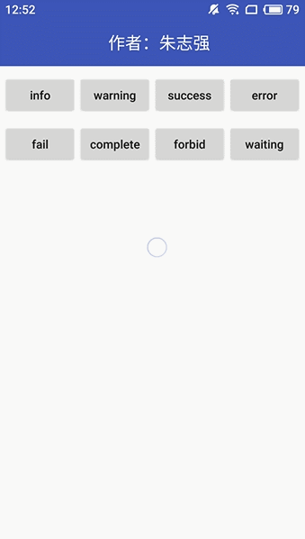
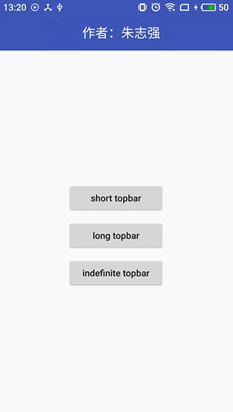
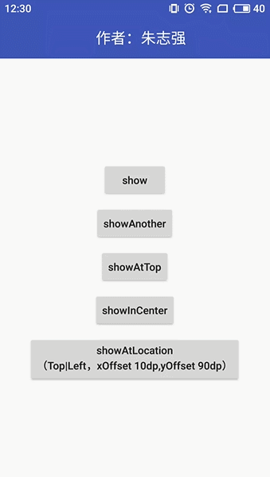
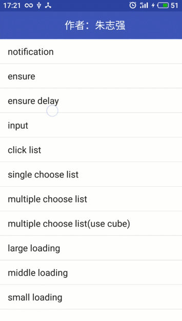
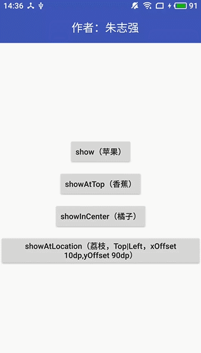
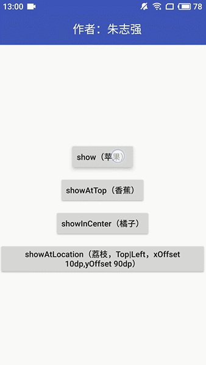
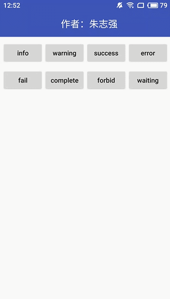
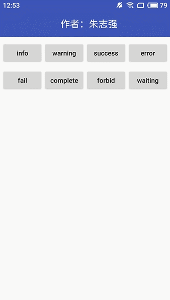
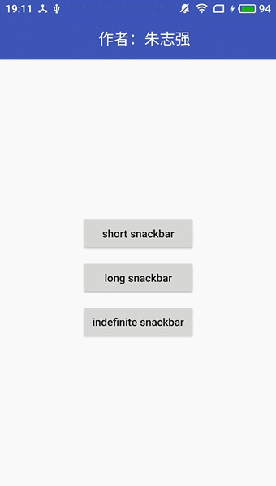
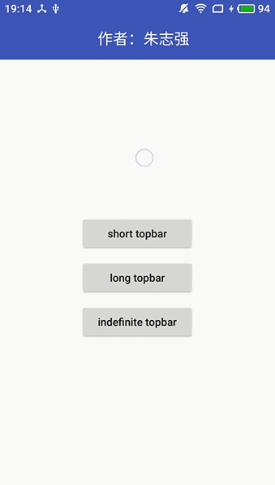

## SmartShow
### 模块导航：
* [SmartToast](#SmartToast部分)
* [SmartSnackbar](#SmartSnackbar部分)
* [SmartTopBar](#SmartTopbar部分)
* [SmartDialog](#SmartDialog部分)
* [关于实现](#代码实现)
* [关于作者](#关于作者)
* [引入该库](#引入SmartShow)
### 功能总览：
1. 优雅封装，简化调用
2. 处理系统bug等，如Android 7.1系统关于Toast的BadTokenException
3. 解决已知的UI性能缺陷，提高用户体验，如Toast重复弹跳等
4. 对不同系统版本及厂商设备进行适配
5. 合理的复用策略，节约内存开销的同时及时解除引用以便被垃圾回收器回收
6. 根据实际开发中的常见需求，进行功能扩展

四大模块的详细功能可查看下面各模块的介绍
### 效果展示
&nbsp;&nbsp;&nbsp;&nbsp; 
&nbsp;&nbsp;&nbsp;&nbsp;  
## 代码实现
[回到模块导航](#模块导航)  
如果你对实现感兴趣，请参考我的CSDN博客：
* 2.x 版本 https://blog.csdn.net/jungle_pig/article/details/83959662
* 1.x 版本 http://blog.csdn.net/jungle_pig/article/details/78568493 
已授权郭霖微信公众号 同步发表：http://mp.weixin.qq.com/s/l62PtbmrIOkVKfJ2r0JwEw
## 关于作者
[回到模块导航](#模块导航)  
为使SmartShow库更加健壮，如果您在使用过程中发现任何问题，请联系我，我会立即跟进修复和维护。感谢您的支持！  
作者：朱志强  
微信：w361281607  
  
邮箱：coder_zzq@163.com 
## 引入SmartShow
[回到模块导航](#模块导航)  
1.在Project的gradle文件中  
<pre><code>
allprojects {

    repositories {

        ...

        maven { url 'https://jitpack.io' }

    }

}
</code></pre>
2.在Module的grable文件中 
<pre><code>

        implementation('com.github.the-pig-of-jungle:SmartShow:v2.4.4') {
        
            exclude group: 'com.android.support'
            
        }
        
        //添加与你项目匹配的design依赖库的相应版本
        
        implementation 'com.android.support:design:x.y.z'
        
</code></pre>
3.在Application的onCreate方法中初始化 
<pre><code>
        SmartShow.init(this);
</code></pre>

## SmartToast部分 
[回到模块导航](#模块导航)
1. 复用Toast实例，当Toast正在显示时，多次触发内容和位置均未改变的Toast，不会重复弹出；下一个Toast不会等到上一个Toast的Duration耗尽才弹出
2. 解决传统复用模式的功能缺陷，如正在显示一个内容为"A"的Toast，此时再弹出内容为"B"的Toast时，文本虽改变，但没有弹出效果；如果复用的Toast正在显示，改变其Gravity以改变显示位置会无效，直到消失后再次显示才生效
3. 可修改Toast默认布局的风格，如背景颜色，文字大小和颜色等
4. 可为Toast设置自定义布局
5. 完美解决Android 7.1的系统bug——Toast BadTokenException
6. 可配置离开当前页面（退出当前activity或进入新的activity），立即消失正在显示的Toast
7. 结合主流app消息提示的效果，提供info、success、error、warnign、complete、forbid、wait、fail 8 种类型的Toast
### 注意
关闭app的系统通知权限,Toast将无法显示。Toast的内部原理使用NotificationManagerService，关闭通知权限后，将无法显示。 
这是原生Toast本身的特性，以淘宝app和优酷app的"再按一次退出程序"的Toast提示为例，关闭通知权限，Toast将不再显示。
### API
调用show方法显示Toast，duration和常用的显示位置体现在方法名上，而不是传参，调用非常简易
#### 普通 Toast
默认样式：设置背景色：
<pre><code>
        //在默认位置显示

        SmartToast.show("我是朱志强");
        
        SmartToast.showLong("我是朱志强");

        //在屏幕顶部显示，水平居中，距离顶部距离与在默认位置显示时，距离底部的距离一致

        SmartToast.showAtTop("我是朱志强");
        
        SmartToast.showLongAtTop("我是朱志强");

        //在屏幕中央显示

        SmartToast.showInCenter("我是朱志强");
        
        SmartToast.showLongInCenter("我是朱志强");

        //在左上角，x，y偏移量为10dp的位置显示

        SmartToast.showAtLocation("我是朱志强",Gravity.LEFT | Gravity.TOP,10,10);
        
        SmartToast.showLongAtLocation("我是朱志强",Gravity.LEFT | Gravity.TOP,10,10);
</pre></code>
#### Type Toast
type toast 均居中显示  
默认样式：设置主题色：
<pre><code>
        //普通
        
        SmartToast.info("已在后台下载");
        
        SmartToast.infoLong("已在后台下载");
        
        
        
        //成功
        
        SmartToast.success("重置成功");
        
        SmartToast.successLong("重置成功");
        
        
        
        //错误
        
        SmartToast.error("保存失败");
        
        SmartToast.errorLong("保存失败");
        
        
        
        //警告
        
        SmartToast.warning("电量过低，请充电");
                
        SmartToast.warningLong("电量过低，请充电");
        
        
        //完成
        
        SmartToast.complete("下载完成");
        
        SmartToast.completeLong("下载完成");
        
        
        //失败
        
        SmartToast.fail("保存失败");
        
        SmartToast.failLong("保存失败");
        
        
        //禁止
        
        SmartToast.forbid("当前账户不允许汇款操作");
        
        SmartToast.forbidLong("当前账户不允许汇款操作");
        
        
        //等候
        
        SmartToast.waiting("已在后台下载，请耐心等待");
        
        SmartToast.waitingLong("已在后台下载，请耐心等待");
</pre></code>

#### 定制化
定制化SmartToast，调用setting方法获取IToastSetting对象进行全局配置
<pre><code>  
        //获取IToastSetting对象
        
        SmartToast.setting()                   
</code></pre>
若自定义布局，可调用View方法传入，在布局中必须定义id为android:id="@id/custom_toast_msg"的TextView显示消息文本 
<pre><code>
          //自定义布局，直接传入View
    
          IToastSetting view(View view);
    
         //自定义布局，传入布局资源
    
         IToastSetting view(@LayoutRes int layout);
</code></pre>      
<pre><code>
            
         //设置布局背景颜色
         
         IToastSetting backgroundColor(@ColorInt int color);
         
         IToastSetting backgroundColorRes(@ColorRes int colorRes);
         
         
         
         // 设置消息文本颜色
         
         IToastSetting textColor(@ColorInt int color);
         
         IToastSetting textColorRes(@ColorRes int color);
         
         
         
         //设置消息文本大小
         
         IToastSetting textSizeSp(float sp);
         
         
         
         //消息文本是否为粗体
         
         IToastSetting textBold(boolean bold);
         
         
         
         //对布局进一步处理，callback中会传入布局的根View和显示消息的TextView，
         
         //callback中的处理和以上配置方法的处理有冲突时，将覆盖掉以上的配置
         
         IToastSetting processView(IProcessToastCallback callback);  
         
         
         
         例子：
         
          SmartToast.setting()
                         
                    .backgroundColorRes(R.color.colorPrimary)
                         
                    .textSizeSp(18)
                    
                    .textBold(true)
                         
                    .processView(new IProcessToastCallback() {
                    
                             //root 为布局根View，msgView为显示消息的TextView
                             
                             @Override                           
                             public void processView(View rootView, TextView msgView) {
                             
                                //... 
                                
                             }
                         });         
</code></pre>
配置 Type Toast 的主题色
<pre><code>
        IToastSetting typeInfoToastThemeColor(@ColorInt int color);
        
        IToastSetting typeInfoToastThemeColorRes(@ColorRes int colorRes);
        
        例子：
        
        SmartToast.setting()
        
                  .typeInfoToastThemeColorRes(R.color.colorPrimary);
</code></pre>
配置离开当前activity时，是否立即隐藏正在显示的Toast（不管是普通Toast还是 Type Toast），默认false
<pre><code>
        IToastSetting dismissOnLeave(boolean b);
        
        例子：
        
        SmartToast.setting()
        
                  .dismissOnLeave(true);
</code></pre>
#### 判断显示和隐藏
<pre><code>
         //是否有Toast在显示
         
         SmartToast.isShowing();

         //隐藏当前显示的Toast

         SmartToast.dismiss();
</code></pre>
## SmartSnackbar部分
[回到模块导航](#模块导航)  

1. 复用Snackbar实例，当Snackbar正在显示，多次触发时，若msg和actionTex均未改变，则不会重复弹出，否则会有弹出效果
2. 可修改布局风格，如背景颜色，文字大小和颜色等
3. 可配置离开当前Activity时，立即消失正在显示的Snackbar。如，在Activity A 上显示了一个Indefinite Snackbar，并且用户没有点击响应，启动activity B，然后再返回A，原来的Snackbar已自动消失
### API
传入当前界面的Activity,获取Snackbar，三种duration体现在方法名上，而不是传参，尽可能简化调用
#### 只传入消息文本
<pre><code>
        //short snackbar
        
        SmartSnackbar.get(this).show("我是朱志强");

        
        //long snackbar
        
        SmartSnackbar.get(this).showLong("我是朱志强");

        
       //indefinite snackbar,只传入消息文本时，会显示默认的动作文本"确定"，点击动作文本，执行默认行为——Snackbar消失
        
       SmartSnackbar.get(this).showIndefinite("我是朱志强");     
</code></pre>
#### 只传入消息文本和动作文本，则点击动作文本执行默认逻辑--Snackbar消失
<pre><code>
       //short snackbar
       
       SmartSnackbar.get(this).show("为SmartShow Star 一下可以么","好的");

       
       //long snackbar
       
       SmartSnackbar.get(this).showLong("为SmartShow Star 一下可以么","好的");

       
       //indefinite snackbar
       
       SmartSnackbar.get(this).showIndefinite("为SmartShow Star 一下可以么","好的");
</code></pre>
#### 传入消息文本和动作文本以及动作监听器
<pre><code>
       SmartSnackbar.get(this).show("我是朱志强", "打赏", new View.OnClickListener() {
       
           @Override
           public void onClick(View v) {
       
                //...
       
              }
           });

           
       SmartSnackbar.get(this).showLong("我是朱志强", "打赏", new View.OnClickListener() {
       
           @Override
           public void onClick(View v) {
       
                //...
       
              }
           });

           
       SmartSnackbar.get(this).showIndefinite("我是朱志强", "打赏", new View.OnClickListener() {
       
           @Override
           public void onClick(View v) {
           
                //...
                
           });              
</code></pre>
* 以上示例获取SmartSnackbar使用的是SmartSnackbar.get(this)，this为当前界面activity，还可使用SmartSnackbar.get(CoordinatorLayout view)。
* 根据谷歌源码，我们知道创建Snackbar时需传入一个当前activity的某个View。实际上，Snackar会以该View为基点，沿着整个View Tree上溯，直到找到CoordinatorLayout容器或android.R.id.content 容器，哪个先找到，就将视图嵌入其中。以CoordinatorLayout为内嵌容器时，Snackbar会有一些特殊的行为，如可以用手指手动滑动移除，显示时会导致FloatingActionButton升高等。
为了提高效率，直接将android.R.id.content或者CoordinatorLayout传入会更好。
* SmartSnackbar对入口做了限制，如果你的页面想以某个具体CoordinatorLayout作为容器，则调用get(CoordinatorLayout view)。否则调用get(Activity activity)，内部会自动将该Activity的 android.R.id.content作为容器。
#### 定制化
定制化SmartSnackbar，可调用setting方法获取ISnackbarSetting对象进行全局配置
<pre><code>
        //获取ISnackbarSetting对象
        
        SmartSnackbar.setting()
</code></pre>
配置布局风格
<pre><code>
        //设置背景颜色
        
        ISnackbarSetting backgroundColor(int color);
        
        ISnackbarSetting backgroundColorRes(int colorRes);

        
        //设置消息文本颜色
        
        ISnackbarSetting msgTextColor(@ColorInt int color);
        
        ISnackbarSetting msgTextColorRes(@ColorRes int colorRes);

        
        //设置消息文本大小
        
        ISnackbarSetting msgTextSizeSp(float textSizeSp);

        
        //设置动作文本颜色
        
        ISnackbarSetting actionColor(@ColorInt int color);
        
        ISnackbarSetting actionColorRes(@ColorRes int colorRes);

        
        //设置动作文本大小
        
        ISnackbarSetting actionSizeSp(float textSizeSp);

        
        //对布局进一步处理，callback中会传入布局的根View和显示消息文本的TextView以及动作文本的Button，
                 
        //callback中的处理和以上配置方法的处理有冲突时，将覆盖掉以上的配置
        
        ISnackbarSetting processView(IProcessBarCallback callback);

        
        //设置调用Indefinite Snackbar时，如果只传入消息文本，默认显示的动作文本字符串，如果不设置，即显示为"确定"
        
        ISnackbarSetting defaultActionTextForIndefinite(String actionText);

        
        //设置离开当前activity时，是否立即消失掉正在显示的Snackbar，默认false。如，在Activity A上显示了一个
        
        //Indefinite Snackbar，启动Activity B，然后按返回键回到A，原先的Snackbar依然存在，设置为true后，
        
        //在进入B之前就会消失
        
        ISnackbarSetting dismissOnLeave(boolean b);

        
        例子：
        
        SmartSnackbar.setting()
                        
        .backgroundColorRes(R.color.colorPrimary)
        
        .msgTextColorRes(R.color.white)
        
        .actionColorRes(R.color.colorAccent)
                        
        .dismissOnLeave(true);
</code></pre>
#### 判断显示和隐藏
<pre><code>

         //隐藏当前显示的Snackbar

         SmartSnackbar.dismiss();

         
         //是否有Snackbar在显示
         
         SmartSnackbar.isShowing();
</code></pre>
#### 监听显示和隐藏
将Activity实现ISnackbarShowCallback接口，然后重写方法即可。在SmartSnackbar显示时，会检测当前activity是否实现该接口，是则进行回调。
<pre><code>
public class SnackbarActivity extends BaseActivity implements ISnackbarShowCallback {

        @Override
        protected int contentLayout() {
    
           return R.layout.activity_smart_show;
        
        }
    
        @Override
        public void onShown(Snackbar sb) {
            
        }
    
        @Override
        public void onDismissed(Snackbar sb, int event) {
    
        }
        
}
</code></pre>
## SmartTopbar部分
[回到模块导航](#模块导航)  
默认样式：设置背景色：
1. SmartTopbar在功能以及使用上很像一个顶部的Snackbar 
2. 当Topbar正在显示，多次触发时，若msg和actionTex均未改变，则不会重复弹出，否则有弹出效果
3. 可修改布局风格，如背景颜色，文字大小和颜色等
4. 可配置离开当前Activity时，立即消失正在显示的Topbar。如，在Activity A 上显示了一个Indefinite Topbar，并且用户没有
点击响应，启动activity B，然后再返回A，原来的Topbar已自动消失
5. 可通过手势右滑隐藏Topbar
### API
传入当前界面的Activity,获取Topbar，三种duration体现在方法名上，而不是传参，尽可能简化调用
#### 只传入消息文本
<pre><code>
        //short topbar
        
        SmartTopbar.get(this).show("我是朱志强");

        
        //long topbar
        
        SmartTopbar.get(this).showLong("我是朱志强");

        
       //indefinite topbar,只传入消息文本时，会显示默认的动作文本"确定"，点击动作文本，执行默认行为——Topbar消失
        
       SmartTopbar.get(this).showIndefinite("我是朱志强");     
</code></pre>
#### 只传入消息文本和动作文本，则点击动作文本，执行默认逻辑--Topbar消失
<pre><code>
       //short topbar
       
       SmartTopbar.get(this).show("为SmartShow Star 一下可以么","好的");

       
       //long topbar
       
       SmartTopbar.get(this).showLong("为SmartShow Star 一下可以么","好的");

       
       //indefinite topbar
       
       SmartTopbar.get(this).showIndefinite("为SmartShow Star 一下可以么","好的");
</code></pre>
#### 传入消息文本和动作文本以及动作监听器
<pre><code>
       SmartTopbar.get(this).show("我是朱志强", "打赏", new View.OnClickListener() {
       
           @Override
           public void onClick(View v) {
       
                //...
       
              }
           });

           
       SmartTopbar.get(this).showLong("我是朱志强", "打赏", new View.OnClickListener() {
       
           @Override
           public void onClick(View v) {
       
                //...
       
              }
           });

           
       SmartTopbar.get(this).showIndefinite("我是朱志强", "打赏", new View.OnClickListener() {
       
           @Override
           public void onClick(View v) {
           
                //...
                
           });              
</code></pre>
#### 定制化
定制化SmartTopbar，可调用setting方法获取ITopbarSetting对象进行全局配置
<pre><code>
        //获取ITopbarSetting对象
        
        SmartTopbar.setting()
</code></pre>
配置布局风格
<pre><code>
        //设置背景颜色
        
        ITopbarSetting backgroundColor(int color);
        
        ITopbarSetting backgroundColorRes(int colorRes);

        
        //设置消息文本颜色
        
        ITopbarSetting msgTextColor(@ColorInt int color);
        
        ITopbarSetting msgTextColorRes(@ColorRes int colorRes);

        
        //设置消息文本大小
        
        ITopbarSetting msgTextSizeSp(float textSizeSp);

        
        //设置动作文本颜色
        
        ITopbarSetting actionColor(@ColorInt int color);
        
        ITopbarSetting actionColorRes(@ColorRes int colorRes);

        
        //设置动作文本大小
        
        ITopbarSetting actionSizeSp(float textSizeSp);

        
        //对布局进一步处理，callback中会传入布局的根View和显示消息文本的TextView以及动作文本的Button，
                 
        //callback中的处理和以上配置方法的处理有冲突时，将覆盖掉以上的配置
        
        ITopbarSetting processView(IProcessBarCallback callback);

        
        //设置调用Indefinite Topbar时，如果只传入消息文本，默认显示的动作文本字符串，如果不设置，即显示为"确定"
        
        ITopbarSetting defaultActionTextForIndefinite(String actionText);

        
        //设置离开当前activity时，是否立即消失掉正在显示的Topbar，默认false。如，在Activity A上显示了一个
        
        //Indefinite Topbar，启动Activity B，然后按返回键回到A，原先的Topkbar依然存在，设置为true后，
        
        //在进入B之前就会消失
        
        ITopbarSetting dismissOnLeave(boolean b);

        
        例子：
        
        SmartTopbar.setting()
                        
        .backgroundColorRes(R.color.colorPrimary)
        
        .msgTextColorRes(R.color.white)
        
        .actionColorRes(R.color.colorAccent)
                        
        .dismissOnLeave(true);
</code></pre>
#### 判断显示和隐藏
<pre><code>

         //隐藏当前显示的Topbar

         SmartTopbar.dismiss();

         
         //是否有Topbar在显示
         
         SmartTopbar.isShowing();
</code></pre>
#### 监听显示和隐藏
将Activity实现ITopbarShowCallback接口，然后重写方法即可。在SmartTopbar显示时，会检测当activity是否实现该接口，是则进行回调。
<pre><code>
public class SnackbarActivity extends BaseActivity implements ITopbarShowCallback {

        @Override
        protected int contentLayout() {
    
           return R.layout.activity_smart_show;
        
        }
    
        @Override
        public void onShown(Topbar tb) {
            
        }
    
        @Override
        public void onDismissed(Topbar tb, int event) {
    
        }
        
}
</code></pre>
## SmartDialog部分
[回到模块导航](#模块导航)  
1. 当宿主activity已经销毁或调用了finish()时，取消Dialog显示，避免BadTokenException问题 
2. 当宿主activity为null(如在Fragment中使用getActivity获取宿主activity)，取消创建Dialog，避免NullPointException问题
3. 提供了主流APP中使用的message、loading等对话框  

#### API
传入activity及DialogCreator对象显示Dialog，DialogCreator负责Dialog的创建,同一DialogCreator实例只会创建
一次Dialog并复用
<pre><code>
    private DialogCreator mDialogCreator;

    public void onBtnClick(View view) {
    
        if (mDialogCreator == null) {
            mDialogCreator = new DialogCreator() {
                @Override
                public Dialog createDialog(Activity activity) {
                    //抽象方法，必须实现
                    //在这里创建Dialog并返回，这里可以确保activity不为null并且没有destroyed或finishing
                    return null;
                }

                @Override
                public void resetDialogPerShow(Dialog dialog) {
                    //非抽象方法，默认为空，可选择性覆写
                    //复用Dialog时，如果想再每次显示前作重置工作，如输入框清空，可以在这里实现
                }
            };
        }
        
        
        SmartDialog.show(this, mDialogCreator);
    }
</code></pre>
#### 预定义的DialogCreator
可设置Dialog的各种属性，在第一次创建Dialog时应用，之后复用Dialog。 
一旦已创建了Dialog，修改DialogCreator各种配置值，并不会应用到复用的对话框上。 
下面是一些公共方法
<pre><code>
public interface INormalDialogCreator\<B> {
    //Dialog显示时窗口以外区域是否变暗
    B darkAroundWhenShow(boolean dim);
    //设置窗口背景
    B windowBackground(@DrawableRes int bgRes);
    //按back键是否可以取消
    B cancelable(boolean b);
    //触碰Dialog窗口外的区域是否取消掉Dialog
    B cancelableOnTouchOutside(boolean b);
    //创建并显示Dialog，如果已创建则复用之，直接显示
    //返回值为是否真正显示了Dialog，当activity为null或者已destroyed或finishing时，返回false
    boolean createAndShow(Activity activity);
    }
   
</code></pre>
#### LoadingDialogCreator
<pre><code>

    private ILoadingDialogCreator mLoadingDialogCreator = DialogCreatorFactory.loading();

    public void onLoadingClick(View view) {
        mLoadingDialogCreator.message("加载中").large().createAndShow(this);
    } 
    
</code></pre>
ILoadingDialogCreator的全部方法
<pre><code>
    //设置提示文本
    
    ILoadingDialogCreator message(CharSequence msg);

    //设置Loading框的大小为large
    
    ILoadingDialogCreator large();

    //设置Loading框的大小为middle
    
    ILoadingDialogCreator middle();

    //设置Loading框的大小为small,此时提示文本隐藏了，只显示loading动画
    
    ILoadingDialogCreator small();

</code></pre>
#### NotificationCreator
<pre><code>
    INotificationCreator mNotificationCreator = DialogCreatorFactory.notification();

    public void onNotificationClick(View view) {
        mNotificationCreator.message("充值成功")
                .createAndShow(this);
    }
</code></pre>
INotificationDialogBuilder的全部方法
<pre><code>
    //设置标题
    
    INotificationDialogBuilder title(CharSequence title);

    //设置确定按钮的文本及点击事件
    
    INotificationDialogBuilder positiveBtn(CharSequence label, DialogBtnClickListener clickListener);

</code></pre>
#### 确认框
确认框与通知框类似，只是多了一个取消按钮
<pre><code>
    SmartDialog.ensure("确定不再关注此人？").create(this).show();
</code></pre>
除了具有INotificationDialogBuilder的全部方法外，IEnsureDialogBuilder如外的方法
<pre><code>
    //设置取消按钮的文本及点击事件
    
    IEnsureDialogBuilder negativeBtn(CharSequence label, DialogBtnClickListener clickListener);
</code></pre>
#### InputTextDialogCreator
<pre><code>
    private IInputTextDialogCreator mInputTextDialogCreator = DialogCreatorFactory.input();

    public void onInputClick(View view) {
        mInputTextDialogCreator
                .inputAtMost(70)
                .hint("输入建议")
                .confirmBtn("确定", new DialogBtnClickListener() {
                    @Override
                    public void onBtnClick(Dialog dialog, int which, Object data) {
                        if (data.toString().length() > 70) {
                            SmartToast.showInCenter("最多只能输入70个字符");
                            return;
                        } else {
                            dialog.dismiss();
                            //do something
                        }
                    }
                })
                //设置标记已输入字符数量的数字的颜色，默认为colorPrimary
                .inputCountMarkColor(Utils.getColorFromRes(R.color.colorPrimary))
                .createAndShow(this);
    }
</code></pre>